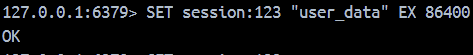
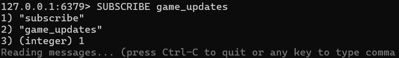

# Database OLA4

## Gruppe F

- Oskar (Ossi-1337, cph-oo221)
- Peter (Peter537, cph-pa153)
- Yusuf (StylizedAce, cph-ya56)

## Simple Application

We have created a Jupyter Notebook in [simple_application.ipynb](./simple_application.ipynb) that demonstrates Configuration 1 and 5 in a Python environment.

## Configurations

We use a [docker-compose.yml](./docker-compose.yml) file as our way of creating redis-stack which includes the Redis database alongside a user interface called Redis Insight.

### Configuration 1: Redis with Retention Policy

**Objective:** To demonstrate how to implement a Retention Policy in Redis.

**Scenario:** The company wants to store user data in Redis for a limited period. User data should be automatically deleted after a certain period of time to free up memory. You need to implement a retention policy to automatically delete expired keys from Redis. This is usually useful when caching data or calls between an API and a website.

**Tasks:**

1.  Install Redis on your machine and configure it to run on the default port (6379).

We use the `docker-compose.yml` file we described in the Configuration section.

2.  Use the Redis CLI or Redis Telnet CLI to set up a retention policy that automatically deletes keys after 24 hours.

We haven't found a way to set it up so it will always delete keys after 24 hours, so our solution is to set the expiration time for each key when we create it.

3.  Use the Redis CLI or Redis Telnet CLI to store user data in Redis.

We use the SET to store user data and we add an EX 86400 (which is 24 hours in seconds) to set the expiration time.

```redis
SET session:123 "user_data" EX 86400
```



4.  Wait for 24 hours and verify that expired keys are automatically deleted from Redis.

We check if the content of the key matches the value we set.

```redis
GET session:123
```

It will either return the content, as shown in:


Or it will show `(nil)` if the key has expired:


Alternatively, we can check the TTL (time to live) of the key to see if it has expired.

```redis
TTL session:123
```

It will either return TTL in seconds, as shown in:


Or it will show `-2` if the key has expired:


### Configuration 4: Redis Security

**Objective:** To demonstrate how to set up security features in Redis.

**Scenario:** The company wants to ensure that user data is secure and can only be accessed by authorized users. You need to set up security features in Redis to protect user data from unauthorized access.

**Tasks:**

1.  Install Redis on your machine and configure it to run on the default port (6379).

We use the `docker-compose.yml` file we described in the Configuration section.

2.  Use the Redis CLI or Redis Telnet CLI to set up a password for Redis.

We have found two solutions for this.

To use the redis-cli, we can set the password using the CONFIG command:

```redis
CONFIG SET requirepass "mysecurepassword"
```

Alternatively, we have found that we can add the following line to the `docker-compose.yml` file to set the password:

```yml
environment:
  - REDIS_ARGS=--requirepass mysecurepassword
```

3.  Use the Redis CLI or Redis Telnet CLI to store user data in Redis.

We log in to Redis using the password we set in the previous step, and then we can set the key and value.

```redis
AUTH mysecurepassword
SET testkey "value"
```


4. Verify that Redis requires a password to access user data.

When we try to retrieve the data without authentication, we should get an error message.

```redis
GET testkey
```

As expected, we recievd the error message `(error) NOAUTH Authentication required.`.


But, when we authenticate with the password, we can retrieve the data.

```redis
AUTH mysecurepassword
GET testkey
```


5. Use the Redis CLI or Redis Telnet CLI to set up access control lists (ACLs) to control access to Redis commands and data.

We can create a new user called `reader` with limited access to the database. This user will only be able to read data from the database, but not write or modify it.

We can do this by using the `ACL SETUSER` command:

```redis
ACL SETUSER reader on >readerpass ~user:* +get
```


Firstly, when we try to set and get a key with the default user it should work to both set and get the key.

```redis
AUTH mysecurepassword
SET user:123 "data"
GET user:123  # Should work
```


But, with the new user `reader`, we can only get the key, but not set it.

```redis
AUTH reader readerpass
GET user:123  # Should work
SET user:123 "new"  # Should fail with NOPERM
```


### Configuration 5: Redis Publish-Subscribe Pattern

**Objective:** To demonstrate how to use the Publish-Subscribe pattern in Redis.

**Scenario:** The company wants to implement a notification system that sends updates to users when their friends are playing games online. You need to implement the Publish-Subscribe pattern in Redis to enable real-time updates for users.

**Tasks:**

1.  Install Redis on your machine and configure it to run on the default port (6379).

We use the `docker-compose.yml` file we described in the Configuration section.

2.  Use the Redis CLI or Redis Telnet CLI to set up a Publish-Subscribe pattern in Redis.

We can use the `SUBSCRIBE <channel>` and `PUBLISH <channel> <message>` commands to set up the Publish-Subscribe pattern.

3.  Use the Redis CLI or Redis Telnet CLI to subscribe to a channel that sends real-time updates for users.

An example of a channel could be `game_updates`, which sends updates when a user starts or stops playing a game.

```redis
SUBSCRIBE game_updates
```



4.  Use the Redis CLI or Redis Telnet CLI to publish a message to the channel.

We can then Publish a message to the channel `game_updates` to notify users when their friends are playing games.

```redis
PUBLISH game_updates "User2 is now playing Counter-Strike 2"
```


5.  Verify that the message is received by all subscribers to the channel.

And then, another user who is subscribed to the channel should receive the message.


